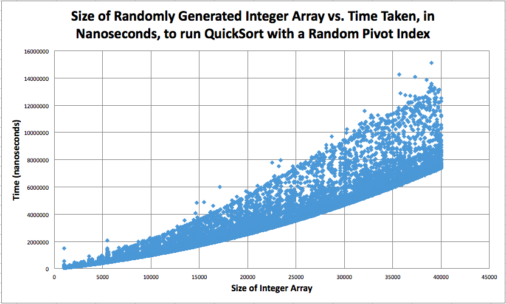

# Runtime of QuickSort - Empirical Style

#### Team WhatShouldOurNameBe - Rohan Ahammed, Joan Chirinos, Soojin Choi - pd08

## Hypothesis
We hypothesize that QuickSort runs at nlogn time on average, but has a worst case of O(n^2). This is based upon traces and using the algorithm on different array states and using different pivot points.

## Background
The process of building towards QuickSort began with another method: partition. Partition splits an array at a givem index, arr[n], into the values lower than arr[n], arr[n], and the values higher than arr[n]. This runs in O(n) time because it will make n - 1 comparisons.
QuickSort takes advantage of that fact by running partition, and then running partition on each side until left with one value. This is similar to mergeSort.
The best case for QuickSort runs in O(nlogn) time involves the pivot point of the partition being in the middle of the sub-array every time. This will split the sub-array into 2 even sides, causing partition to be run O(logn) times. Because each partition takes O(n) time, we classify this case as O(nlogn).
By extension, we can see that, if the first pivot point's final position is index 0 and the following if the chosen pivot points' positions are the index following the last pivot point's final position, we end up with a O(n^2) runtime.
Additionally, we can see that slightly imperfect runs will have additional coefficients than the best case. This makes them practically slower, but the same runtime classification.

## Experiment Methodology
We have a popArray method which takes an array of size n and populates it with random integers in the range (-100, 100), inclusive of -100. We also have a timer method that returns, as a double, the time, in nanoseconds, QuickSort takes to sort a given array. Our main method initiates an ArrayList used to store array size and times. It runs 2 nested for-loops: one to store an array size variable from 1000 to 40000 (counting up by 100s) and one to run and record the timer method for the given array size 100 times. Ultimately, we get 39100 data points, which we graph using Excel

## Results

Here we can see a nlogn relationship

## Conclusions
<Write stuff here>
As seen in the data and the graph, the QuickSort has a runtime of O(nlogn) as we had predicted. 

The variance in our graph may be due to the pivot point and the data arrangement. In our QuickSort, we had the pivot point be chosen as a random place between the left and right bounds. This eliminates the chance of a sorted subarray resulting in a poor runtime. There are possible worst cases with a random pivot point, but it's hard to predict. The best case being that its final resting position is in the middle, decreasing the amount of elements to be sorted in each division.

### Big Oh classifications for... (at the algorithm level)
- Best Case = O(nlogn)
  - The random pivot points always end up in the center of their respective subarrays
- Most Likely Case = O(nlogn)
  - The random pivot chosen ends up close the the center of its respective subarray, making approximately, but greater than, logn partitions
- Worst Case = O(n^2)
  - The pivot that is chosen results in the largest amount of partitions, causing a runtime of nlogn
